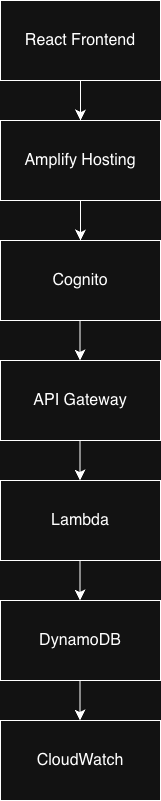

# UniReserve

A serverless campus resource booking platform built on AWS.

## Tech Stack

- React
- AWS Amplify
- Amazon Cognito
- API Gateway
- Lambda
- DynamoDB
- CloudWatch

## Features

- Resource management
- Booking system
- Authentication
- Admin approval workflow

## Architecture

